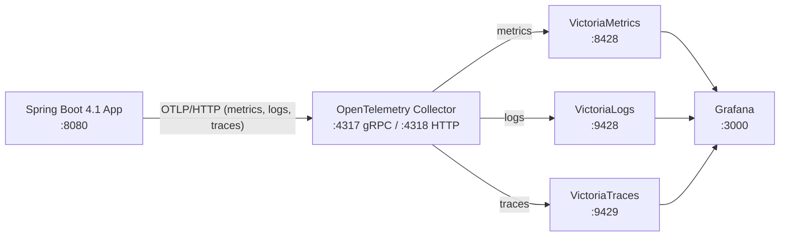

# VictoriaMetrics + Spring Boot Observability Demo

[](https://github.com/patbaumgartner/victoria-metrics-spring-boot-demo/actions/workflows/ci.yml)
[](LICENSE)
[](https://spring.io/projects/spring-boot)
[](https://adoptium.net/)
[](https://opentelemetry.io/)

A complete, runnable example of **full-stack observability** for a Spring Boot
application using the [VictoriaMetrics](https://victoriametrics.com/) ecosystem.
Metrics, logs, and traces are exported over **OTLP** to an OpenTelemetry
Collector, which fans each signal out to a purpose-built Victoria backend and
visualizes everything in Grafana — no Prometheus scraping, no vendor agents.

## Highlights

- **Spring Boot 4.1 native telemetry** — metrics, traces, and logs configured
  entirely through `application.yml`, no manual SDK boilerplate.
- **Single OTLP push** — the app sends all three signals to one collector
  endpoint (`OTEL_EXPORTER_OTLP_ENDPOINT`).
- **Purpose-built storage** — VictoriaMetrics (metrics), VictoriaLogs (logs),
  VictoriaTraces (traces, Jaeger-compatible query API).
- **Auto-provisioned Grafana** — datasources and dashboards load on startup.
- **One-command startup** — `docker compose up -d --build`.

## Architecture



| Component | Role | Port |
|-----------|------|------|
| Spring Boot App | Generates telemetry | `8080` |
| OpenTelemetry Collector | Receives OTLP, routes per signal | `4317`, `4318`, `13133` |
| VictoriaMetrics | Metrics storage (OTLP ingest) | `8428` |
| VictoriaLogs | Log storage (OTLP ingest) | `9428` |
| VictoriaTraces | Trace storage + Jaeger query API | `9429` |
| Grafana | Unified visualization | `3000` |

## Quick Start

**Prerequisites:** [Docker](https://docs.docker.com/get-docker/) and Docker Compose v2.

```bash
git clone https://github.com/patbaumgartner/victoria-metrics-spring-boot-demo.git
cd victoria-metrics-spring-boot-demo
docker compose up -d --build
```

Or use the helper script:

```bash
./start-observability.sh
```

Then open **Grafana** at http://localhost:3000 (`admin` / `admin123`).

### Generate some traffic

```bash
curl http://localhost:8080/api/hello
curl http://localhost:8080/api/data
curl -X POST http://localhost:8080/api/process \
  -H "Content-Type: application/json" -d '{"value":"demo"}'
curl http://localhost:8080/api/slow-operation
curl http://localhost:8080/api/error
```

Within ~10 seconds the metrics, logs, and traces appear in Grafana.

### Tear down

```bash
docker compose down        # stop containers
docker compose down -v     # stop and remove volumes (reset all data)
```

## Application Endpoints

| Method | Endpoint | Description |
|--------|----------|-------------|
| `GET`  | `/api/hello` | Simple greeting with timestamp |
| `GET`  | `/api/data` | Simulated database fetch (~100–300 ms) |
| `POST` | `/api/process` | Processes posted data (~150–400 ms) |
| `GET`  | `/api/slow-operation` | Deliberately slow (2 s) for latency testing |
| `GET`  | `/api/error` | Throws a simulated error |
| `GET`  | `/api/health/custom` | Custom health response |
| `GET`  | `/actuator/health` | Spring Boot health endpoint |
| `GET`  | `/actuator/metrics` | Available metrics |

## How Telemetry Is Wired

All telemetry is exported via OTLP/HTTP using Spring Boot 4.1's native support:

| Signal | Mechanism |
|--------|-----------|
| **Metrics** | Micrometer `OtlpMeterRegistry` (`management.otlp.metrics.export.url`) |
| **Traces** | Micrometer Tracing → OpenTelemetry (`management.opentelemetry.tracing.export.otlp.endpoint`) |
| **Logs** | Logback `OpenTelemetryAppender` (registered programmatically in [`OpenTelemetryAppenderInitializer`](app/src/main/java/com/example/OpenTelemetryAppenderInitializer.java)) |

Custom spans and timers are produced with Micrometer's `@Observed` annotation
(see [`DemoService.java`](app/src/main/java/com/example/service/DemoService.java)).

> **Note:** The OpenTelemetry Logback appender is *not* bundled with Spring Boot.
> It is added via the `opentelemetry-logback-appender-1.0` dependency and attached
> to the root logger at startup by
> [`OpenTelemetryAppenderInitializer`](app/src/main/java/com/example/OpenTelemetryAppenderInitializer.java),
> so no `logback-spring.xml` is required — all telemetry config lives in `application.yml`.

## Project Structure

```
.
├── app/                              # Spring Boot 4.1 demo application
│   ├── src/main/java/com/example/    # Controller, service, OTel appender initializer
│   ├── src/main/resources/           # application.yml
│   ├── Dockerfile                    # Multi-stage build
│   ├── pom.xml
│   └── README.md                     # App-specific details
├── observability/
│   ├── otel-collector/               # Collector config (OTLP in, 3 exporters out)
│   ├── grafana/provisioning/         # Datasources + dashboards (auto-loaded)
│   └── README.md                     # Stack-specific details
├── docker-compose.yml                # 6-service orchestration
├── start-observability.sh            # One-command startup + health checks
├── QUICK_START.md                    # Condensed cheat sheet
└── OBSERVABILITY_STACK.md            # Design notes and rationale
```

## Documentation

- **[QUICK_START.md](QUICK_START.md)** — condensed commands and smoke tests.
- **[OBSERVABILITY_STACK.md](OBSERVABILITY_STACK.md)** — design choices and rationale.
- **[app/README.md](app/README.md)** — application internals and endpoints.
- **[observability/README.md](observability/README.md)** — collector and Grafana details.

## Building Locally (without Docker)

Requires JDK 21. From the `app/` directory:

```bash
cd app
./mvnw clean package
./mvnw spring-boot:run
```

The app expects the observability backends to be reachable; the simplest path is
to run the full stack via Docker Compose.

## Contributing

Contributions are welcome! Please read [CONTRIBUTING.md](CONTRIBUTING.md) and our
[Code of Conduct](CODE_OF_CONDUCT.md) before opening an issue or pull request.

## Security

Found a vulnerability? Please review our [Security Policy](SECURITY.md).

## License

Licensed under the [Apache License 2.0](LICENSE).

## Acknowledgements

- [VictoriaMetrics](https://victoriametrics.com/) — metrics, logs, and traces backends
- [OpenTelemetry](https://opentelemetry.io/) — vendor-neutral telemetry
- [Spring Boot](https://spring.io/projects/spring-boot) — application framework
- [Grafana](https://grafana.com/) — visualization
